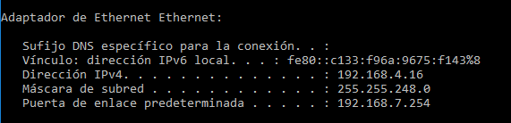

# Practica Iniciación (Introducción al sistema operativo "Windows Server" Repaso: Máquinas Virtuales

## 1. ¿Qué aplicaciones de virtualización tienes instaladas en el equipo?

VirtualBox

## 2. ¿Cuáles son sus versiones?

Versión 5.2.18 r124319 (Qt5.6.2)

## 3. ¿Son las últimas versiones de las mismas?

No, la ultima seria VirtualBox 5.2.22 released!

## 4. En el sistema de archivos de Windows ¿En qué carpetas se instalan dichas aplicaciones?

`C:\Program Files\Oracle\VirtualBox`

## 5. ¿Quién es el fabricante de VirtualBox? ¿Qué otros programas están entre los más conocidos de dicho fabricante? Cita al menos dos y describe su funcionalidad

El fabricante de VirtualBox fue Innotek GmbH quien libero el software bajo licencia GPLv2 y ahora esta bajo Oracle VM VirtualBox que es doftware privado

## 6. ¿Para qué sirven las “extension packs” de VirtualBox?

Compatibilidad con dispositivos USB 2.0 y USB 3.0, VirtualBox RDP, cifrado de disco, arranque NVMe y PXE para tarjetas Intel

## 7. ¿Qué configuración de red tiene tu equipo actual, direcciones, DHCP, estática, etc.?

Tengo configurada la direccion ip en modo estatica, con las sigientes direcciones

## 8. ¿Qué es la dirección MAC del equipo? ¿Cómo puedes identificarla en tu equipo?

La direccion mac es la direccion fisica de tu targeta de red y se puede identificar ejecutando el siguiente comando `ipconfig /all` en la terminal de windows

## 9. La configuración de la tarjeta de red en VirtualBox ofrece las seis posibilidades que se muestran en la imagen de la derecha.Describe para qué sirve cada una de ellas, ejemplificando lasmismas. Describe lo que ocurriría en cada caso con la comunicación por red entre tu equipo (anfitrión) y las máquinas virtuales que hubieras configurado con las distintas opciones.