# Practica UTF8_2 (Instalar Windows Server 2016 en VirtualBox)

Descripcion del proceso de instalación `Windows Server 2016´
> Recomendación propia utiliza Debian(linux) antes que Windows Server

## Paso 1 (Descarga del archivo ISO)

Nos dirigimos al siguiente enlace <https://www.microsoft.com/en-us/cloud-platform/windows-server-trial> para descargar el la imagen iso de nuestro sistema operativo.

En cuanto abramos la pagina web aparecern las siguientes opciones.

1. Nos aseguramos de que estemos dentto de la seccion Windows Server 2016.
2. Tenemos que tener la opción ISO seleccionada.
3. Pulsamos sobre el boton Continuar.

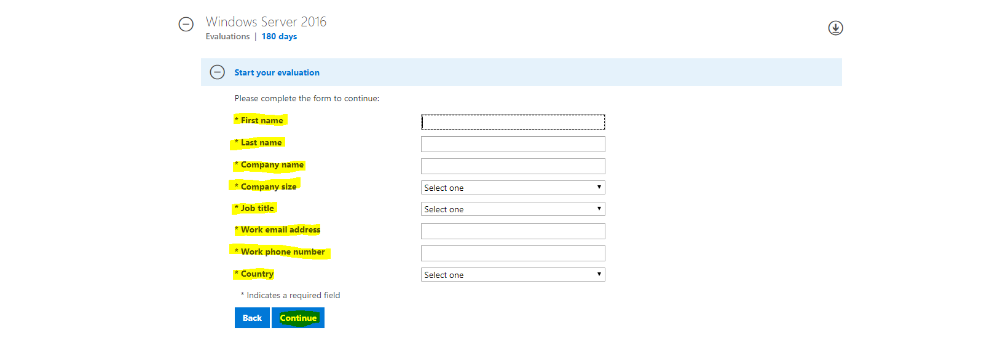

1. Rellenamos los campos que nos exige microsoft ("No entinedo para que quiere microsoft el nombre de nuestro puesto de trabajo").
2. Pulsamos sobre el boton Continuar.

Despues de rellenar todos los datos microsoft no obfrece la opcion de subscribirse al boletin de noticias par a mandarnos informacion sobre subs nuevos productos.

Windows nos pregunta en que idioma queremos nuestra ISO, en mi caso yo seleciono spain("español").
  
Despues de esto le hacemos click en el boton "Descarcargar" y comenzara nuestra descarga

## Paso2 (Preparación de la máquina virtual)

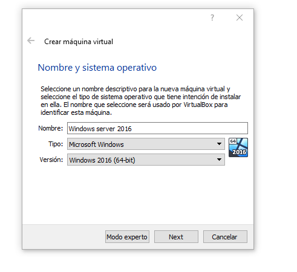

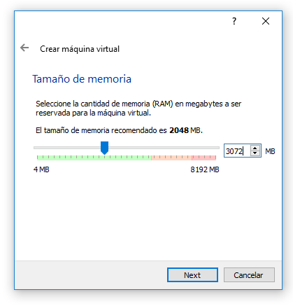

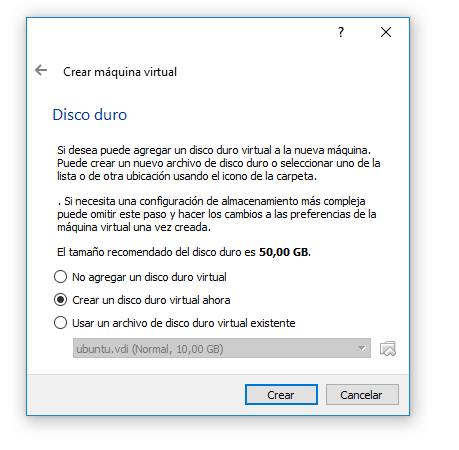

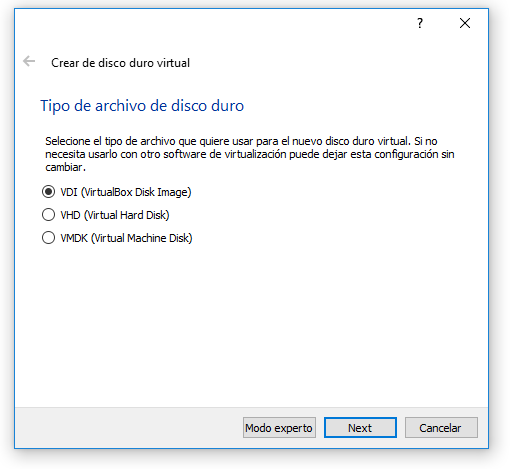

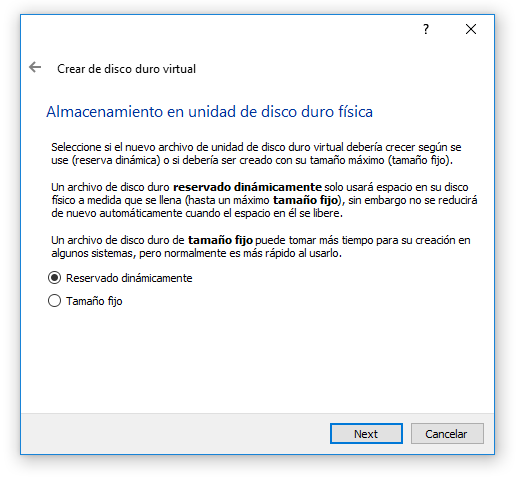

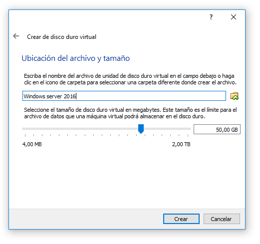

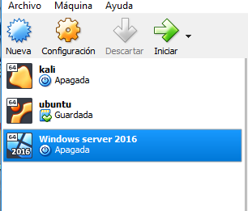

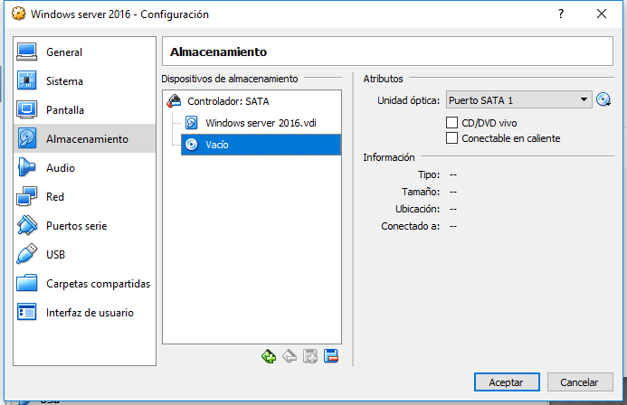

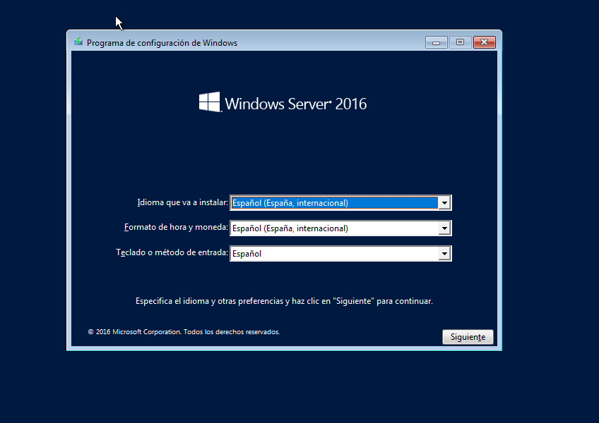

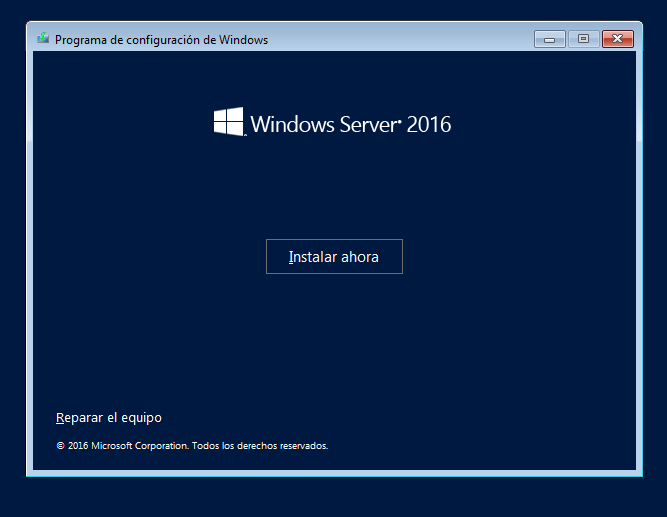

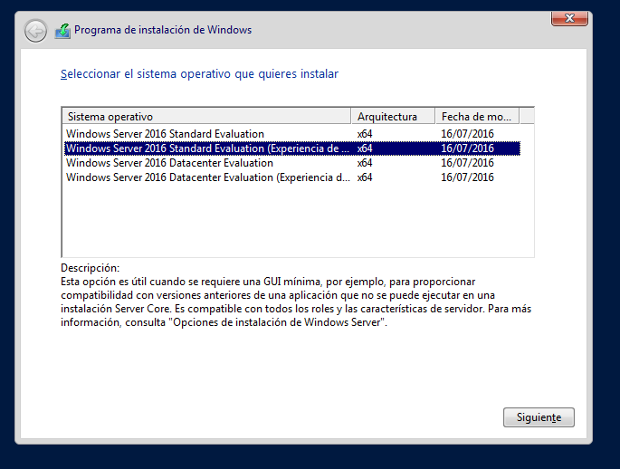

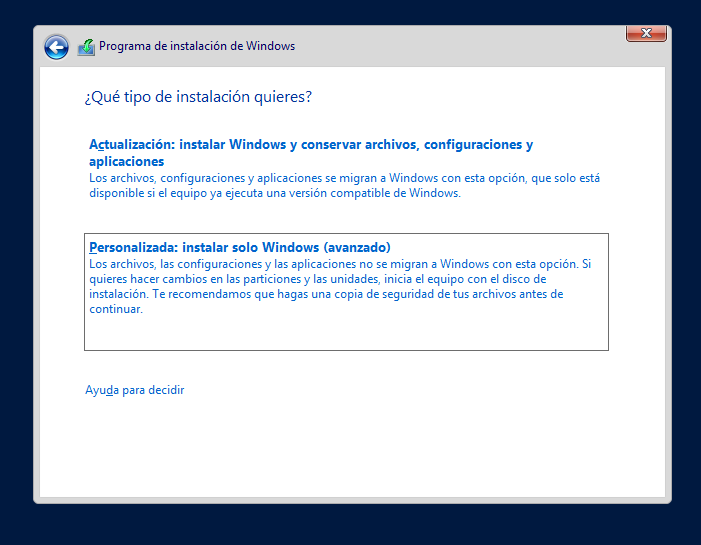

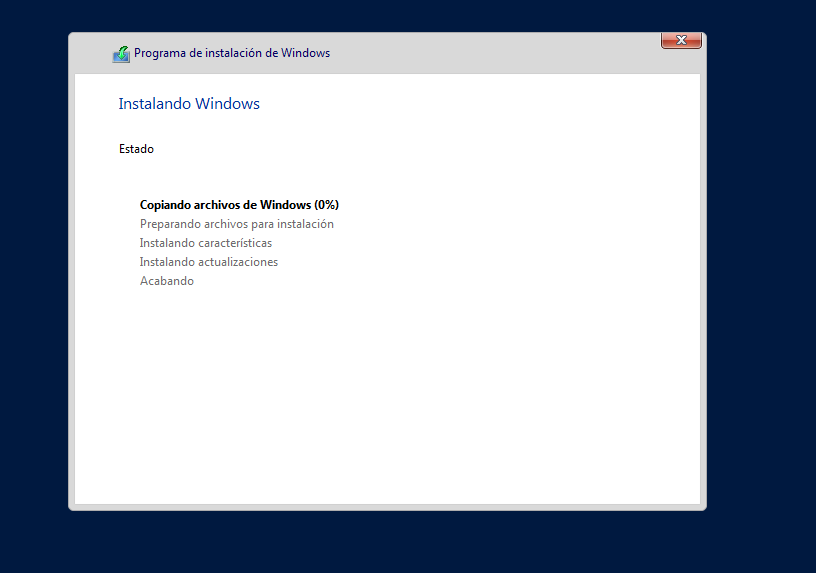

