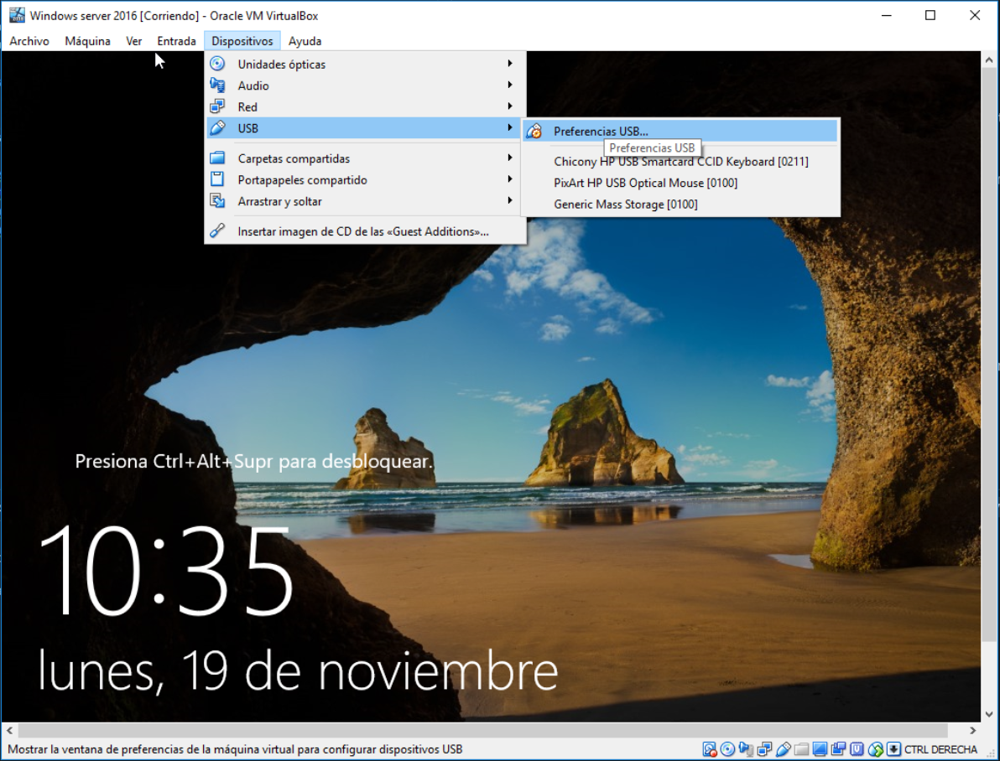
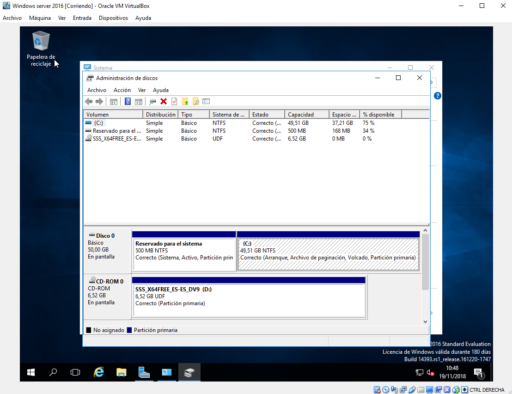

# UT8_3. Introducción al sistema operativo Windows Server. (VirtualBox)

## RESPONDE A LAS SIGUIENTES PREGUNTAS

### 2.- ¿Qué funcionalidades añaden las Guest Additions?.

Son un conjunto de controladores e dispositivos y aplicaciones dentro del sistemas invitado (guest) que mejoran el rendimineto y la usabilidad

### 3.- Investiga cómo harías para poder leer tu lapiz USB desde la máquina virtula de WS2016.

Con la maquina virtual abierta  hacemos click en  `Dispositivos -> USB -> (Nuestro USB)`

### 4.- ¿Cuánto ocupa la instalación de WS2016 en tu disco duro?.

Mi instalacion ocupa 10,9GB

### 5.- Muestra cuántas particiones genera WS2106 en el disco duro. Investiga para qué sirve cada una de ellas.

### 6.- La máquina virtual que acabas de instalar, ¿en qué directorio se almacena en tu ordenador?

C:\Users\Cristian\VirtualBox VMs\Windows server 2016