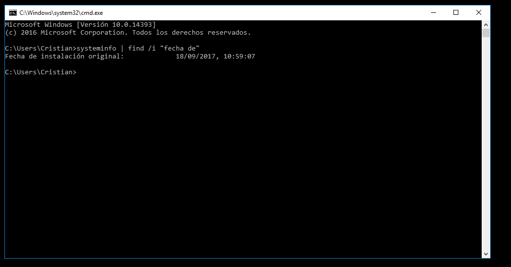

# UT8_4. Introducción al sistema operativo Windows Server. (Hyper-V con Windows 10)

## 1. ¿Cómo puedes saber la versión exacta de tu Windows 10?

En el menu de cortana escribimos "Acerca de mi pc", y hacemos click en ese elemento, nos saldra la informacion del sistema de windows

## 2. Una vez que la sabes ¿de qué fecha es la actualización que tienes instalada en tu equipo?

Usamos el comando `systeminfo | find /i "fecha de"`

## 3. ¿De qué fecha es la última actualización disponible de Windows 10?

En el menu de cortana escribimos "actualizacion", hacemos click en el elemento y nos saldra la siguiente ventana

Hacemos click en en `Historial de actualizaciones` y nos saldra la ventana con el historial de actualizaciones

## 4. Si no cambiamos su configuración, Windows 10 se actualiza automáticamente él mismo. Investiga cómo podríamos evitar que lo haga.

En el `gpedit.msc` cambiando la directiva "Configurar Actualizaciones Automaticas" dentro de `"Configuracion de equipo -> Plantillas administrativas -> Componentes de Windows -> Windows Update"`

## 5. ¿Qué pasos deberíamos seguir para actualizarlo nosotros manualmente?

Deberiamos ir a `"Configuración -> actualizaciones y seguridad"` seleccionamos `BUSCAR ACTUALZACIONES`, de esta manera se nos actualizaría manualmente.