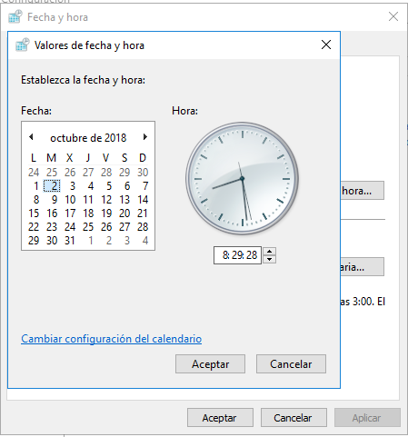

# P_8_5. Introducción al sistema operativo Windows Server. (Configurar Windows Server 2016 con interfaz gráfica)

## 1.- Explora todas las opciones de la configuración horaria y haz capturas de pantalla explicando las funcionalidades que se encuentran en cada una de ellas.

### Fecha y Hora.

Activar / Desactivar el ajuste automático de hora: permite ajustar la fecha y hora automáticamente, si le damos a desactivar, podemos modificar la fecha y hora manualmente en el botón que aparece más bajo.
Activar/Desactivar establecimiento de la zona horaria automática: funciona igual que el anterior permitiendo desactivar o activar la zona horaria automática.
Opciones adicionales de fecha, hora y configuración general:

### Idioma.

### Región.

## 2.- Configura la red de modo que la máquina virtual pueda acceder a Internet y al mismo tiempo sea accesible desde Windows 10 en el ordenador en que está instalada. Explica todo el proceso que realices tanto en la configuración de VirtualBox cómo en el propio Windows Server. Haz capturas de pantalla donde se muestre que la comunicación entre ambas máquinas es posible. para

En la máquina virtual abrimos el Centro de redes y recursos compartidos.

Hacemos clic en Cambiar configuración del adaptador.
Aquí seleccionamos propiedades de Ethernet y comprobamos que la conectividad IPV6 no tiene acceso a la red.

En las propiedades de Ethernet desmarcamos la casilla IPv6 para deshabilitarla.

En la máquina virtual seleccionamos Configuración-Red-Conectado a: y aquí seleccionamos adaptador puente y nuestro adaptador de red.

3.- Cambia el nombre del equipo poniéndole servidor-XX-NAA, siendo XX el número de tu PC y NAA las iniciales de tu nombre y apellidos.

Se puede acceder al equipo desde w10 y desde WServer.
